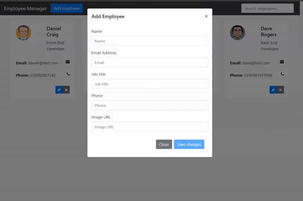

# Employee Manager Back-End
The back-end of a simple app to manage employees. Developed as a study project.

## Preview

## Setup
* You must download the <a href="https://github.com/thomashammes/employee-manager-frontend" target="_blank">Front-end repository</a> as well.
* Then use Spring Boot to run the `EmployeemanagerApplication` class.

## Built with
* Java 17
* Spring Boot 3.2.3

## Credits
* This project was based on the Amigoscode Java + Angular course.
